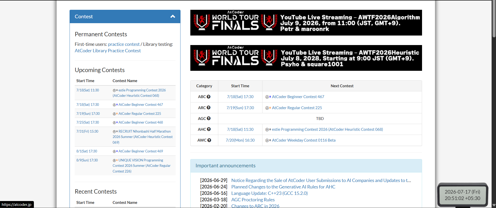
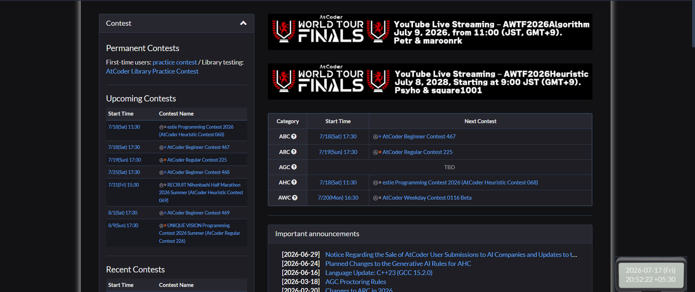
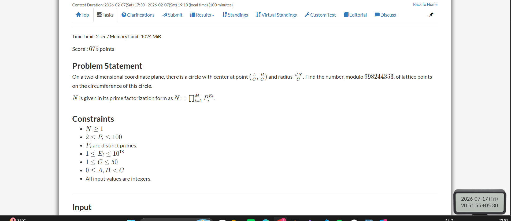
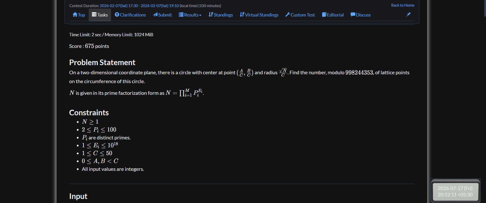
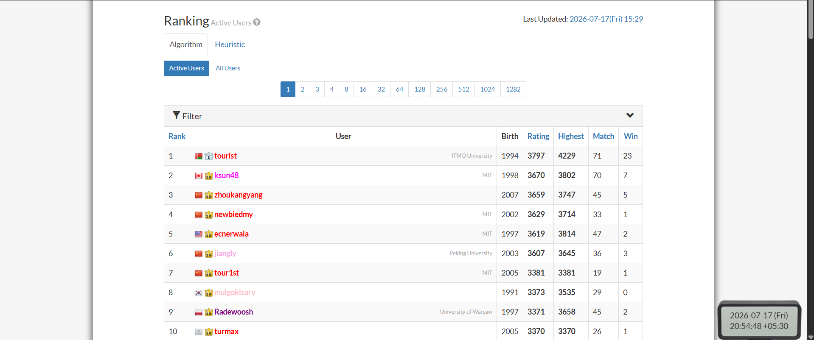
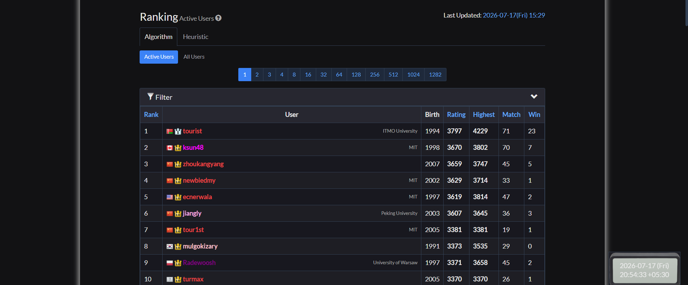

# AtCoder Aesthetic Dark Mode

A beautiful, premium, handcrafted dark theme for the AtCoder website (`https://atcoder.jp/*`). 

Built as a lightweight Manifest V3 Chrome extension, this theme avoids lazy CSS inversion filters (which corrupt syntax highlighting and competitive rating badges) and instead targets individual Bootstrap elements to deliver a sleek, matte black/grey dark mode experience.

---

## 📸 Visual Comparisons (Light vs. Dark)

### 🏠 Home Page
The homepage features a dark layout for all panels, lists, and information boxes. The contest announcements footer containing "last update" and social share buttons is styled to match the dark panels cleanly.

| Light Mode | Dark Mode |
| :---: | :---: |
|  |  |

---

### 📝 Problem Page
The problem description, code submission section, and code editors (both CodeMirror and Ace Editor) are fully adapted for dark mode. Code blocks and editor themes preserve high-contrast syntax highlighting.

| Light Mode | Dark Mode |
| :---: | :---: |
|  |  |

---

### 🏆 Ranking Page
User handles retain their official colors (Gray, Brown, Green, Cyan, Blue, Yellow, Orange, Red) and rating badge styling, but are tweaked to ensure high accessibility and contrast. The page chooser (pagination) component is styled dark with a matching green toggle theme.

| Light Mode | Dark Mode |
| :---: | :---: |
|  |  |

---

## ✨ Key Features

1. **Precision Styling (No Filters):** 
   Avoids `filter: invert(1)` color corruptions. Rating colors, CodeMirror/Ace editors, and semantic submission badges (Accepted `AC`, Wrong Answer `WA`, Waiting for Judgment `WJ`) remain perfectly readable and correctly colored.
2. **Preventing "White Flash":**
   The theme scripts are read and executed at `document_start` directly onto the `<html>` element to ensure zero page load white flashes.
3. **Sleek Control Popup**:
   An elegant dark-themed popup card featuring a smooth green toggle switch to turn the dark theme on or off. State synchronization happens instantly across all open AtCoder tabs without needing to refresh pages.
4. **Enhanced Navigation**:
   Navbar hover states are designed to remain dark and readable (preventing them from turning bright white or losing contrast on focus).

---

## 🛠️ How to Install and Run Locally

Since this extension is not yet hosted on the Chrome Web Store, you can run it locally in Developer Mode.

### Step 1: Download the Code
1. Clone or download this repository.
2. If downloaded as a ZIP file, extract it to a folder on your computer.

### Step 2: Load into Google Chrome
1. Launch Google Chrome.
2. In the address bar, type **`chrome://extensions/`** and press Enter.
3. In the top-right corner of the Extensions page, toggle the **"Developer mode"** switch to **ON**.
4. In the top-left corner, click the **"Load unpacked"** button.
5. Select the folder containing this extension (the folder containing the `manifest.json` file).

### Step 3: Start Using
1. Navigate to [AtCoder](https://atcoder.jp/).
2. Pin the **AtCoder Aesthetic Dark Mode** extension from the extensions puzzle menu in your Chrome toolbar.
3. Click the extension icon to toggle the theme on or off at any time!

---

## 📁 File Structure

```
Atcoder-web-extension/
├── manifest.json       # Extension manifest (MV3 configuration)
├── content.js          # Injects styles and listens for runtime toggles
├── theme.css           # Custom dark mode stylesheet (Bootstrap 3 overrides)
├── popup.html          # Pop-up switch layout (matte black/grey themed)
├── popup.js            # Saves theme preferences to local storage
├── generate_icons.py   # Script to generate extension icons
├── icons/              # Extension icons (16x16, 48x48, 128x128)
└── images/             # Light/Dark mode comparison screenshots
```

---

## 🤝 Contributing & Feedback

If you find a page that isn't fully styled or has poor contrast, feel free to contribute!
* Profile: [SamarthBhatia77](https://github.com/SamarthBhatia77)
* Project URL: `https://github.com/SamarthBhatia77`
